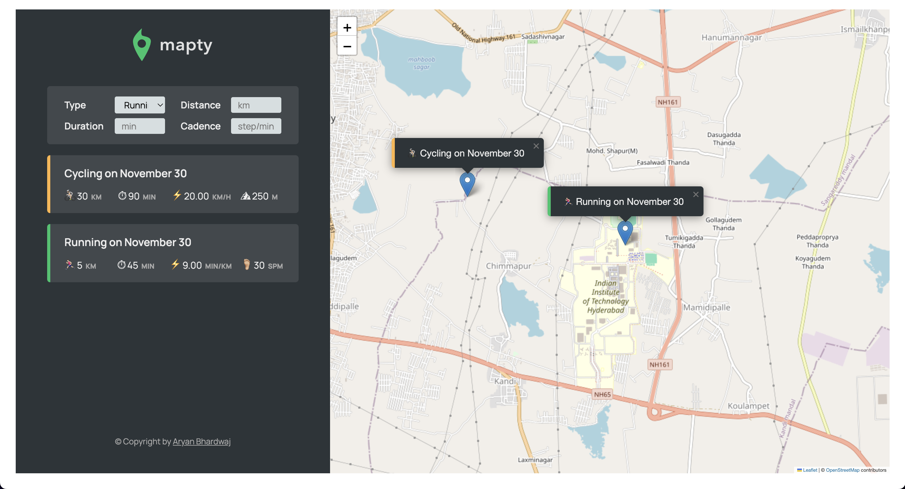

# Mapty: Workout Tracking Application

Mapty is an intuitive web application designed to track your running and cycling workouts. Built with modern JavaScript, it utilizes geolocation and map functionalities to record workout locations and details, providing users with a visually engaging and organized tracking experience.

---

## 🚀 Live Demo

[https://mapty-aryanbhardwaj.netlify.app/](https://mapty-aryanbhardwaj.netlify.app/)

---

## 🎥 Screenshot



---

## 📖 Features

- **Interactive Map Integration**:  
  Utilize Leaflet.js to visualize workout locations on an interactive map.

- **Workout Types**:  
  Track two types of workouts:

  - 🏃‍♂️ **Running**: Includes cadence and pace calculations.
  - 🚴‍♀️ **Cycling**: Includes elevation gain and speed calculations.

- **Geolocation Support**:  
  Automatically load the user’s current location and allow manual location selection for workouts.

- **Dynamic Workout Rendering**:  
  Add, view, and manage workouts directly from the app’s interface.

- **Persist Data with Local Storage**:  
  Workouts are saved in the browser's local storage, ensuring data persistence between sessions.

- **Mobile-Responsive Design**:  
  Optimized for various screen sizes, ensuring a seamless user experience on desktops, tablets, and mobile devices.

---

## 🛠️ Technologies Used

- **Frontend**:

  - HTML5, CSS3
  - Vanilla JavaScript (ES6 Classes)

- **Maps**:

  - Leaflet.js for map rendering and interactivity

- **Geolocation**:

  - Browser's `navigator.geolocation` API

- **Data Storage**:
  - Local Storage API

---

## 📂 Project Structure

```
 ┣ 📜index.html
 ┣ 📜style.css
 ┣ 📜script.js
 ┗ 📂assets
   ┗ 🖼️icon.png
   ┗ 🖼️logo.png
 ┣ 🔖.gitignore
```

---

## 🌟 Contributing

Contributions are welcome! If you have any ideas or improvements, feel free to fork the project and submit a pull request. To contribute, please follow these steps:

1. Fork the repository
2. Create a new branch (`git checkout -b feature-branch-name`)
3. Commit your changes (`git commit -m 'Add feature'`)
4. Push to the branch (`git push origin feature-branch-name`)
5. Open a Pull Request

---

## 📜 License

This project is licensed under the [MIT License](LICENSE).

---

## 🙌 Acknowledgments

- **Leaflet.js**: For providing the interactive map integration
- **OpenStreetMap Contributors**: For the map tiles
- **Google Fonts**: For typography resources

---

## 👤 Author

**Aryan Bhardwaj**

- [LinkedIn](https://www.linkedin.com/in/aryanbhardwaj24/)
- [Github](https://github.com/aryanbhardwaj24/)
